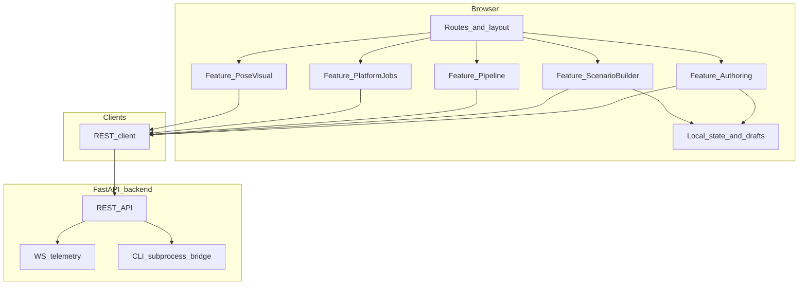

# Архитектура фронтенда: AUROSY Skill Factory

Документ описывает **слой веб-приложения** (браузер): модули, потоки данных и границы ответственности. Детали контрактов JSON и перечень HTTP/WebSocket эндпоинтов — в репозитории бэкенда (см. [backend_references.md](backend_references.md)); актуальные схемы — в OpenAPI (`GET http://<host>:8000/docs`).

---

## 1. Назначение приложения

Локальный (или сетевой) **SPA**: инженерный и пользовательский UI для:

- авторинга Phase 0 (`keyframes`, `motion`, `scenario`);
- визуальной работы с позой робота (Pose Studio — 2D-схема и 3D MuJoCo WASM);
- сборки сценариев из mid-level действий и оценки длительности;
- запуска конвейера preprocess → playback → train через API;
- сохранения артефактов и постановки асинхронного train в очередь Phase 5 (`/jobs`);
- индикации режима телеметрии на бэкенде (`telemetry_mode` на Главной из `GET /api/meta`); поток `/ws/telemetry` остаётся контрактом API, отдельного экрана live-потока во фронте сейчас нет.

Фронтенд **не** выполняет CLI и **не** обращается к DDS напрямую: только через FastAPI.

---

## 2. Высокоуровневая архитектура

- **REST client:** единая обёртка над `fetch` в [`src/api/client.ts`](../../web/frontend/src/api/client.ts) (базовый URL из `VITE_API_BASE` или относительный путь в dev через прокси Vite).
- **WebSocket `/ws/telemetry`:** контракт бэкенда; во фронтенде есть модуль [`src/hooks/useTelemetryWebSocket.ts`](../../web/frontend/src/hooks/useTelemetryWebSocket.ts), но **ни один экран** в текущей сборке его не подключает — отдельной страницы «Телеметрия» нет (маршрут `/telemetry` редиректит на `/pose`).
- **Local state:** черновики JSON (авторинг), выбранные ноды сценария, UI-флаги.

---

## 3. Фиче-модули и соответствие экранам

| Модуль | Ответственность | Ключевые API / данные |
|--------|-----------------|------------------------|
| **Authoring** | Редактирование и проверка JSON: keyframes, motion, scenario | `POST /api/validate`; схемы из `public/contracts/` |
| **Pose / visualization** | 2D-схема по группам суставов; 3D MuJoCo WASM | `GET /api/joints`; ассеты в `public/pose/`, `public/mujoco/g1/` |
| **Scenario builder** | Каталог mid-level действий, сборка цепочки нод, оценка длительности | `GET /api/mid-level/actions`, `POST /api/scenario/estimate` |
| **Pipeline** | Формы preprocess / playback / train; отображение exit_code, stdout/stderr | `POST /api/pipeline/preprocess`, `playback`, `train`; `GET /api/pipeline/detect-cli` |
| **Platform jobs** | Сохранение JSON-артефактов; постановка асинхронного train; список задач | `POST /api/platform/artifacts/{name}`, `POST /api/jobs/train`, `GET /api/jobs`, `GET /api/jobs/{job_id}` |
| **Packages** | Skill Bundle: список, скачивание, загрузка, публикация | `GET /api/packages`, `POST /api/packages/from-job/{job_id}`, `POST /api/packages/upload` |
| **Telemetry (API)** | Поток состояния суставов — на стороне бэкенда | `WebSocket /ws/telemetry` (во фронте отдельный экран не смонтирован) |

### Маршруты

Определены в [`web/frontend/src/App.tsx`](../../web/frontend/src/App.tsx):

| Путь | Компонент |
|------|-----------|
| `/` | `Home` |
| `/authoring` | `Authoring` |
| `/telemetry` | Редирект на `/pose` (`Navigate`, совместимость закладок) |
| `/scenarios` | `ScenarioBuilder` |
| `/pipeline` | `Pipeline` |
| `/jobs`, `/jobs/:jobId` | `Jobs` |
| `/packages` | `Packages` |
| `/pose` | `PoseStudio` |
| `/help` | `Help` |
| `/settings` | `Settings` |

---

## 4. Потоки данных

1. **Валидация авторинга:** пользователь редактирует JSON → клиентская проверка по JSON Schema (AJV) → `POST /api/validate` для серверной проверки Phase 0.
2. **Сценарий:** загрузка списка действий → локальная сборка графа/списка нод → `POST /api/scenario/estimate` → отображение оценок.
3. **Конвейер:** пользователь передаёт пути к файлам на машине бэкенда или встраивает JSON → бэкенд запускает subprocess → фронт показывает логи и результаты.
4. **Платформа / задачи:** сохранение JSON как артефакта → постановка train в очередь → опрос `GET /api/jobs/{id}` до терминального статуса.
5. **Телеметрия (бэкенд):** эндпоинт `/ws/telemetry` отдаёт поток JSON; в текущей версии SPA нет экрана, который подписывается на него. На **Главной** при доступном API показывается `telemetry_mode` из `GET /api/meta`.

---

## 5. Технический стек

| Слой | Реализация |
|------|------------|
| Сборка | Vite 5; версия приложения в сборке — `__APP_VERSION__` (из `package.json`, см. [`vite.config.ts`](../../web/frontend/vite.config.ts); отображается на `/settings`) |
| UI | React 18, React Router 6 |
| Тесты | Vitest (`npm test`, `npm run test:watch`) |
| Стили | CSS в [`src/styles.css`](../../web/frontend/src/styles.css), компоненты в [`src/components/ds/`](../../web/frontend/src/components/ds/) |
| Валидация JSON | AJV + схемы из [`public/contracts/`](../../web/frontend/public/contracts/) |
| Локализация | i18next + react-i18next; словари [`src/locales/ru.json`](../../web/frontend/src/locales/ru.json), [`en.json`](../../web/frontend/src/locales/en.json) |
| 3D | Three.js + @react-three/fiber + @mujoco/mujoco (WASM) |
| Drag-and-drop | @dnd-kit/core, @dnd-kit/sortable |
| Уведомления | sonner |

---

## 6. Границы ответственности

| Зона | Фронтенд | Бэкенд |
|------|----------|--------|
| Истинная валидация Phase 0 | Отображение ошибок | `POST /api/validate`, валидатор в Python |
| Запуск CLI preprocess/playback/train | Только запросы и отображение результата | Subprocess, пути к репозиторию/SDK |
| Телеметрия с робота | Индикация `telemetry_mode` на Главной; WS-клиент в коде не подключён к экранам | DDS или mock, агрегация в JSON, эндпоинт `/ws/telemetry` |
| Файловая система хоста | Ввод путей (если API принимает пути) | Чтение/запись файлов |
| OpenAPI | Использование как контракта | Генерация из FastAPI |

---

## 7. Связанные документы

- [02_design_system.md](02_design_system.md) — токены и компоненты UI.
- [FAQ.md](FAQ.md) — частые вопросы.
- [backend_references.md](backend_references.md) — документы и пути в репозитории бэкенда.
- [../mujoco-wasm-browser.md](../mujoco-wasm-browser.md) — 3D MuJoCo в браузере.
